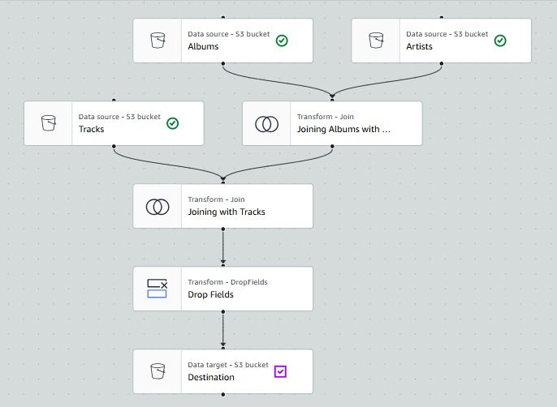
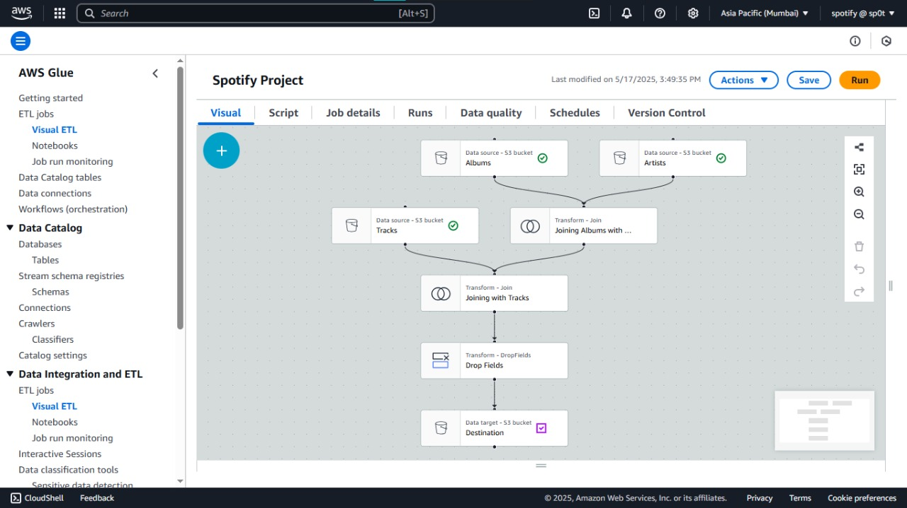
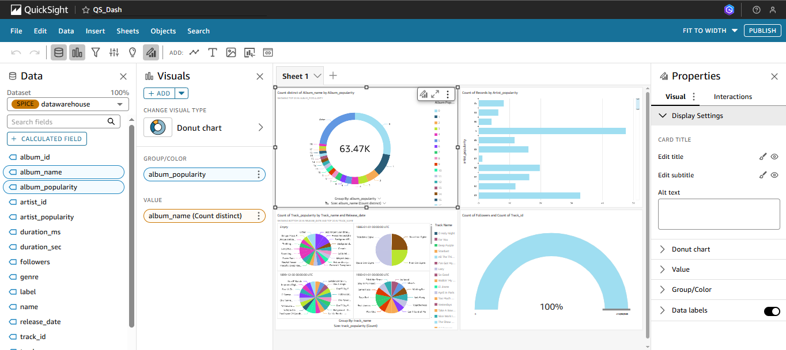

<h1 align="center">🎧 Spotify Data Engineering Project on AWS 🚀</h1>

  
  
  
  
  
  

---

## 📌 Project Overview

This project demonstrates a modern **end-to-end data pipeline** using AWS services with Spotify data. It simulates how real-time data from Spotify can be ingested, processed, queried, and visualized using:

- **AWS S3** for storing raw & transformed data
- **AWS Glue** for building scalable ETL jobs (using Python)
- **AWS Athena** for serverless querying of large datasets
- **AWS QuickSight** for intuitive and powerful dashboarding

The focus is on using **serverless** and **pay-as-you-go AWS services** to minimize cost and maximize scalability — perfect for real-world Data Engineering pipelines.

---

## ⚙️ Tech Stack & Tools

| Tool/Service     | Purpose                          |
|------------------|----------------------------------|
| AWS S3           | Raw & curated zone for data lake |
| AWS Glue         | ETL jobs to clean/transform data |
| AWS Athena       | Querying data with SQL           |
| AWS QuickSight   | Interactive dashboards & charts  |
| Python (boto3)   | Automation & scripting           |
| Jupyter Notebook | Exploration & data validation    |

---

## 📊 Key Features

- 🔄 **Automated ETL Pipeline** with AWS Glue (PySpark script)
- 🧹 **Data Cleaning & Transformation** from raw Spotify JSON
- 📁 **Raw + Curated Zone Architecture** on S3
- 🕵️‍♂️ **Schema-on-Read** via Athena
- 📈 **Beautiful Dashboard** using QuickSight
- 🔒 **Fully serverless**, scalable & cost-effective

---

## 📸 Sample Dashboard Preview

> *(Add a screenshot image of your QuickSight dashboard below)*

---
\

## 📝 Introduction
Ever wondered what stories your Spotify listening habits could tell? This project transforms raw Spotify data into powerful insights. We'll build a modern data pipeline on AWS, using S3 for storage, Glue for smart data processing, Athena for querying our music universe, and finally, QuickSight to bring those musical stories to life through vibrant visualizations. Get ready to unlock the power of your playlists!

## 🏗️ Project Architecture
The overall architecture illustrates how data flows from ingestion to visualization using AWS services:

 

## 🌊 Pipeline Flow & Data Journey
The data engineering pipeline processes Spotify data through the following key stages:

1.  **📥 Ingestion & Raw Storage (Amazon S3):**
    *   Raw Spotify data (e.g., CSV files for Albums, Artists, Tracks) is ingested and stored in a designated **Amazon S3** bucket (acting as the "raw zone" of the data lake).

2.  **⚙️ ETL Processing (AWS Glue):**
    *   An **AWS Glue ETL job** (developed using the AWS Glue Visual ETL interface and detailed in the Python script) extracts data from the raw S3 locations.
    *   It performs transformations such as:
        *   Joining datasets (e.g., Albums with Artists, then with Tracks).
        *   Cleaning data (e.g., dropping unnecessary fields, handling nulls).
        *   Structuring data for analytics.
    *   The detailed visual workflow for this Glue job is shown below:

    \
    *Figure: The AWS Glue job graph showing S3 data sources (Albums, Artists, Tracks), join operations, the 'DropFields' transformation, and the final S3 data target.*

    *   The transformed and curated data is then loaded into a different **Amazon S3** bucket/prefix, serving as the "data warehouse zone."

4.  **🗺️ Schema Discovery & Cataloging (AWS Glue Crawler):**
    *   An **AWS Glue Crawler** runs against the S3 data warehouse zone.
    *   It infers the schema of the processed data and creates/updates table definitions in the **AWS Glue Data Catalog**.

5.  **🔍 Querying & Analysis (Amazon Athena):**
    *   **Amazon Athena** uses the metadata from the AWS Glue Data Catalog to execute standard SQL queries directly on the data stored in the S3 data warehouse zone.
    *   This allows for ad-hoc analysis and data exploration without needing to load data into a traditional database. Query results can also be saved back to S3.

6.  **📊 Visualization & Reporting (Amazon QuickSight):**
    *   **Amazon QuickSight** connects to Amazon Athena as a data source.
    *   It fetches query results to build interactive dashboards, reports, and visualizations, enabling insights 💡 into the Spotify data.

## 🎨 AWS Glue Studio Interface
The ETL jobs are developed and managed within the AWS Glue Studio environment, which provides a comprehensive visual interface for designing and monitoring data integration workflows.

 

*Figure: The AWS Glue console displaying the "Spotify Project." The "Visual" tab shows the ETL job graph, and the left-hand navigation provides access to various Glue features.*

## 🐍✨ Core ETL Script (`Spotify Project.py`)
The engine driving the data transformation in this project is the Python script `Spotify Project.py`. This script is crafted for execution as an **AWS Glue ETL job**, harnessing the capabilities of PySpark for efficient, distributed data processing.

**🔗 Script Location:**
*   Access the complete script here:
    [`Spotify Project.py`](https://github.com/Subhajit-Chowdhury/Spotify_Data-Engineering-using-AWS/blob/main/Spotify%20Project.py)

**🚀 Key Responsibilities & Functionality:**
This script translates the visual ETL design into executable code, performing the following critical operations:

1.  **🎬 Initialization:** Establishes the Spark and AWS Glue execution environment.
2.  **📥 Data Extraction (Extract):** Reads `albums.csv`, `artists.csv`, and `tracks.csv` from S3.
3.  **🛠️ Data Transformation (Transform):** Performs joins, cleaning, and structuring of the data.
4.  **💾 Data Loading (Load):** Writes the final, unified dataset to the S3 data warehouse zone, typically in Parquet format.

**💻 Technologies Leveraged within the Script:**
*   **Python (🐍):** Primary language for ETL logic.
*   **PySpark (✨):** Framework for distributed data processing.
*   **AWS Glue Libraries:** For integration with the Glue environment (`GlueContext`, `DynamicFrame`).

**💡 Execution Note:** This script is intended for deployment as an AWS Glue ETL job, requiring proper IAM permissions and S3 path configurations.

## 🧾 Dataset Utilized
This project uses a modified version of the "Spotify Dataset 2023" which has been structured into three separate CSV files for processing. The original dataset is dedicated to the public domain.

### 🔗 Original Source & Inspiration
*   **Platform:** Kaggle
*   **Dataset Name:** Spotify Dataset 2023
*   **Uploader:** Tony Gordon Jr.
*   **Kaggle Link:** [https://www.kaggle.com/datasets/tonygordonjr/spotify-dataset-2023](https://www.kaggle.com/datasets/tonygordonjr/spotify-dataset-2023)
*   **License:** **CC0: Public Domain** (The creator has waived all copyright and related rights to this work.)

### 📂 Project Dataset Structure
The dataset for this project is organized into the following three CSV files, ingested into the `raw/` S3 zone:

1.  **💿 `albums.csv`:** Information on Spotify albums.
    *   **Source File:** [`data/albums.csv`](https://github.com/Subhajit-Chowdhury/Spotify_Data-Engineering-using-AWS/blob/main/data/albums.csv)
    *   *(Key columns: `album_id`, `name`, `release_date`, `total_tracks`, `artists_id_array`)*
2.  **🎤 `artists.csv`:** Details about Spotify artists.
    *   **Source File:** [`data/artists.csv`](https://github.com/Subhajit-Chowdhury/Spotify_Data-Engineering-using-AWS/blob/main/data/artists.csv)
    *   *(Key columns: `artist_id`, `name`, `genres`, `popularity`)*
3.  **🎶 `tracks.csv`:** Attributes for individual Spotify tracks.
    *   **Source File:** [`data/tracks.csv`](https://github.com/Subhajit-Chowdhury/Spotify_Data-Engineering-using-AWS/blob/main/data/tracks.csv)
    *   *(Key columns: `track_id`, `name`, `album_id`, `artists_id_array`, `duration_ms`, `explicit`, `popularity`)*

**Note:** Inspect files via GitHub links for full column details. These are joined in AWS Glue.

## 🛠️ Technologies & Tools Used
This project constructs a data engineering pipeline leveraging core **Amazon Web Services (AWS)**—specifically **S3** for data storage, **AWS Glue** for ETL processing, **Amazon Athena** for querying, and **Amazon QuickSight** for visualization—along with **Python** and **PySpark** to process, analyze, and visualize Spotify data.

1.  **☁️ Cloud Platform:** **Amazon Web Services (AWS)** - Foundational cloud environment.
2.  **📂 Data Storage (Data Lake on S3):** **Amazon S3** - Central data lake with raw, staging, and data warehouse zones.
3.  **🔄 Data Processing & Transformation (ETL):** **AWS Glue** (using Python & PySpark) - Core ETL service with Jobs and Crawlers.
4.  **📚 Metadata & Schema Management:** **AWS Glue Data Catalog** - Centralized metadata store.
5.  **🔍 Querying & Data Exploration:** **Amazon Athena** - Serverless SQL querying on S3.
6.  **📊 Business Intelligence & Visualization:** **Amazon QuickSight** - Cloud-native BI for dashboards.
7.  **👩‍💻 Programming Language & Framework 🐍✨:**
    *   **Python (🐍):** Primary language for Glue ETL logic.
    *   **PySpark (✨):** Distributed processing framework within Glue.
8.  **🔐 Security & Access Control:** **AWS IAM** - Manages permissions.

## 🚀 Project Demonstrations
To provide a clearer understanding of the project's components and workflow in action, short video demonstrations have been recorded:

*   **AWS Glue - ETL Process:**
    *   🎬 **Watch Demo:** [https://github.com/Subhajit-Chowdhury/Spotify_Data-Engineering-using-AWS/blob/main/AWS%20GLUE%20Overview.mp4]
    *   *Description:* Showcases AWS Glue job execution and data transformation.
*   **Amazon Athena - Querying Data:**
    *   🔍 **Watch Demo:** [https://github.com/Subhajit-Chowdhury/Spotify_Data-Engineering-using-AWS/blob/main/Athena%20Overview.mp4]
    *   *Description:* Demonstrates querying processed data in S3 using Athena.
*   **Amazon QuickSight - Data Visualization:**
    *   📊 **Watch Demo:** [https://github.com/Subhajit-Chowdhury/Spotify_Data-Engineering-using-AWS/blob/main/QuickSight_Dashboard.mp4]
    *   *Description:* Walkthrough of the interactive QuickSight dashboard.

## 📈 QuickSight Dashboard - Spotify Insights
The culmination of this data pipeline is an interactive dashboard built in Amazon QuickSight, providing insights into the Spotify dataset.

**Key Visualizations Uncover:**
*   How album popularity is distributed across the music catalog!
*   Which artists command the highest track counts based on their popularity!
*   The ebb and flow of track releases across different eras!

**Dashboard Snapshot:**

 
*(Caption: Overview of the main Spotify analytics dashboard, revealing interesting patterns in your music world!)*

**🔗 View Full Dashboard (PDF):**
*   The complete dashboard is available as a PDF document in this repository:
    [`Spotify_QuickSight_Dashboard.pdf`](https://github.com/Subhajit-Chowdhury/Spotify_Data-Engineering-using-AWS/blob/main/Spot_QS-Dash.pdf)

## ⚙️ How to Run / Setup (High-Level)
To replicate this project, you would typically follow these steps:

1.  **Prerequisites:**
    *   AWS Account with appropriate permissions.
    *   Download the Spotify dataset from Kaggle and split it into `albums.csv`, `artists.csv`, and `tracks.csv`.
2.  **S3 Setup:**
    *   Create S3 buckets for different zones: `your-raw-bucket`, `your-staging-bucket`, `your-datawarehouse-bucket`, `your-athena-query-results-bucket`.
    *   Upload the raw CSV files to the `your-raw-bucket`.
3.  **AWS Glue Setup:**
    *   Create an AWS Glue ETL job, providing the `Spotify Project.py` script.
    *   Configure the job with appropriate IAM roles, data source paths (pointing to raw S3 data), and data target paths (pointing to the S3 data warehouse zone).
    *   Create an AWS Glue Crawler to scan the S3 data warehouse zone and populate the Glue Data Catalog.
4.  **Amazon Athena Setup:**
    *   Ensure a database is created in Athena (the Crawler usually does this).
    *   Verify that tables corresponding to your processed data are available and queryable.
5.  **Amazon QuickSight Setup:**
    *   Connect QuickSight to Athena as a data source.
    *   Create a new dataset in QuickSight based on your Athena table(s).
    *   Build your dashboard using the created dataset.
6.  **IAM Roles & Permissions:** Ensure all services (Glue, Athena, QuickSight) have the necessary IAM permissions to access S3 and other required resources.

*(This is a high-level guide. Specific configurations might vary.)*

## 🏁 Conclusion
This project successfully demonstrates the construction of an end-to-end, serverless data engineering pipeline on AWS for Spotify data analytics. By ingesting raw data, performing robust ETL transformations with AWS Glue and PySpark, enabling ad-hoc querying with Amazon Athena, and delivering insights through Amazon QuickSight, we've showcased a practical approach to turning data into valuable knowledge. This pipeline not only provides a framework for analyzing music trends but also serves as a testament to the power and flexibility of cloud-based data solutions.

## 📜 License
This project's code is licensed under the MIT License. Please see the `LICENSE` file for more details.
The dataset used is under the CC0: Public Domain license, as specified by its Kaggle source.

